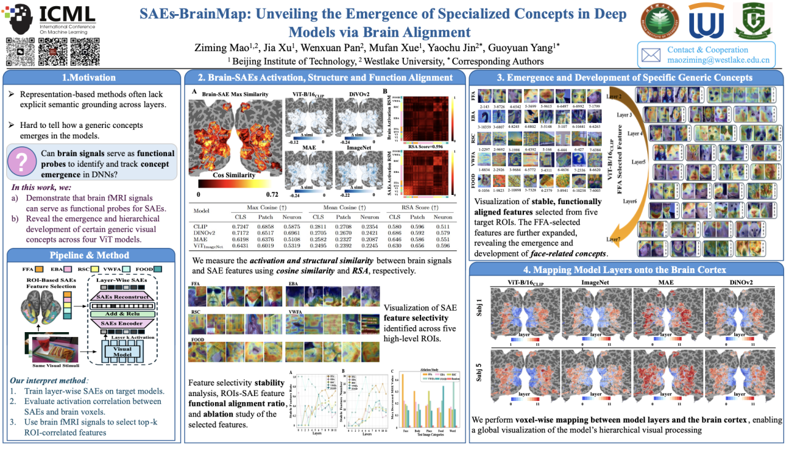

# SAEs-BrainMap: Unveiling the Emergence of Specialized Concepts in Deep Models via Brain Alignment

<p align="center">
  
</p>

---

## Quick Start

The entire pipeline can be executed directly using the provided `run.sh` script.

```bash
bash run.sh
````

Before running the script, please ensure that all required project paths have been correctly configured in `config.toml`.

Due to the complexity of the codebase, some legacy and experimental functions have been retained for reference but are no longer used in the current implementation. If you encounter any confusion or have any questions, please feel free to contact the authors.

---

## Citation

If you find this repository useful in your research, please consider citing our paper:

```bibtex
@inproceedings{maosaes,
  title={SAEs-BrainMap: Unveiling the Emergence of Specialized Concepts in Deep Models via Brain Alignment},
  author={Mao, Ziming and Xu, Jia and Pan, Wenxuan and Xue, Mufan and Jin, Yaochu and Yang, Guoyuan},
  booktitle={Forty-third International Conference on Machine Learning}
}
```
